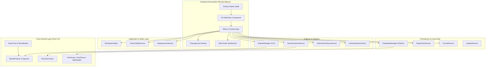
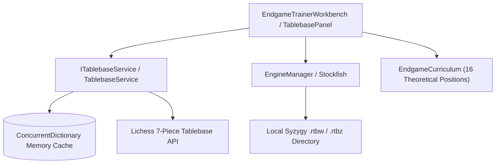

# Caissalytics System Architecture

This document details the software architecture, design patterns, and internal subsystem specifications of Caissalytics Desktop.

---

## 1. High-Level Architectural Overview

Caissalytics is built as a modular desktop workstation leveraging .NET 10 (C# 14) and Photino.Blazor:



---

## 2. Core Chess Domain (`Caissalytics.Core`)

The core chess library contains zero UI dependencies, zero native bindings, and is designed for high-performance move validation and game tree manipulation.

### Board Representation & Moves
- **[`Square`](file:///home/tomask/projects/Caissalytics/Caissalytics/Core/Square.cs)**: An 8-bit integer (`0` to `63`) mapping files `a-h` (`0..7`) and ranks `1-8` (`0..7`).
- **[`BoardPosition`](file:///home/tomask/projects/Caissalytics/Caissalytics/Core/BoardPosition.cs)**: Lightweight 64-square board array with active turn color, castling availability rights, en-passant target square, and halfmove/fullmove clocks.
- **[`Move`](file:///home/tomask/projects/Caissalytics/Caissalytics/Core/Move.cs)**: A 32-bit readonly record struct containing:
  - `From` & `To` squares.
  - `Promotion` piece type (`Queen`, `Rook`, `Bishop`, `Knight`).
  - `Flags`: Bitflags for `Capture`, `Castling`, `EnPassant`, and `Promotion`.

### Move Generation & Legality (`MoveGenerator.cs`)
- Generates pseudo-legal moves for pieces (pawns, knights, bishops, rooks, queens, kings).
- Performs king safety validation to filter pseudo-legal moves into strictly legal moves.
- Supports destination mapping (`GetLegalDestinations`) for instant, zero-allocation Chessground UI highlight validation.
- Provides specialized checks for check detection, checkmate, stalemate, and insufficient material draws.

### Game Tree & Annotations (`GameTree.cs`, `MoveNode.cs`)
- Hierarchical tree structure supporting arbitrary branch variations and transpositions.
- Every `MoveNode` retains:
  - Position state (`BoardPosition`)
  - SAN notation string
  - NAG glyphs (e.g. `!`, `?`, `!?`, `??`)
  - Human commentary and analysis text
  - UCI engine evaluation cache (`EvalCentipawns`, `MateInMoves`)

---

## 3. UCI Chess Engine Integration (`Caissalytics.Engine`)

### Process Management & UCI Protocol
- **[`EngineManager.cs`](file:///home/tomask/projects/Caissalytics/Caissalytics/Engine/EngineManager.cs)**:
  - Spawns background OS engine processes (e.g. `stockfish`) using asynchronous standard input/output pipes.
  - Implements the standard Universal Chess Interface (UCI) protocol (`uci`, `isready`, `ucinewgame`, `position fen ... moves ...`, `go multipv ...`, `stop`).
  - Parses real-time engine evaluation streams: depth, selective depth, score (`cp` / `mate`), nodes per second (NPS), and Principal Variation (PV) candidate lines.
  - Implements process termination safety, ensuring rogue background engine processes are cleanly destroyed on exit or workspace reset.

### Automatic Engine Downloader & System Probing
- Detects host OS architecture (Linux x64/ARM64, Windows x64).
- 1-click automatic download and verification of official Stockfish binaries.
- Engine file probing (`ProbeEngineFileAsync`) validates UCI handshakes before registering custom user engines.
- System directory scanning (`ScanSystemEnginesAsync`) discovers pre-installed system engines (e.g., `/usr/bin/stockfish`).

### Automated Game Analysis (`GameAnalysisService.cs`)
- Evaluates every move in a game tree at a configurable depth/time budget.
- Calculates win-probability loss curves using standard centipawn-to-win-percentage formulas.
- Classifies moves into:
  - **Brilliant** / **Great Move**
  - **Best Move** / **Book Move**
  - **Inaccuracy** ($\Delta \text{win\%} \in [5\%, 10\%]$)
  - **Mistake** ($\Delta \text{win\%} \in [10\%, 20\%]$)
  - **Blunder** ($\Delta \text{win\%} > 20\%$)
- Calculates overall game Accuracy Percentage for White and Black.

---

## 4. SQLite Chess Database Architecture (`Caissalytics.Data`)

### High-Throughput Indexing & Schema
Caissalytics uses SQLite with Write-Ahead Logging (WAL) and memory-mapped I/O for ultra-responsive game queries across hundreds of thousands of games.

```sql
-- Master Games Registry
CREATE TABLE games (
    id INTEGER PRIMARY KEY AUTOINCREMENT,
    event TEXT,
    site TEXT,
    date TEXT,
    round TEXT,
    white TEXT,
    black TEXT,
    result TEXT,
    white_elo INTEGER,
    black_elo INTEGER,
    eco TEXT,
    ply_count INTEGER,
    pgn TEXT NOT NULL
);

-- Position Lookups for Opening Tree & Candidate Stats
CREATE TABLE positions (
    id INTEGER PRIMARY KEY AUTOINCREMENT,
    fen TEXT NOT NULL,
    game_id INTEGER NOT NULL REFERENCES games(id) ON DELETE CASCADE,
    move_san TEXT NOT NULL,
    move_uci TEXT NOT NULL,
    move_number INTEGER NOT NULL,
    color TEXT NOT NULL
);

CREATE INDEX idx_positions_fen ON positions(fen);
CREATE INDEX idx_games_players ON games(white, black);
CREATE INDEX idx_games_date ON games(date);
```

### Dynamic Aggregations
Position candidate lookups join `positions` with `games` to calculate in a single query:
- Total games reaching the position
- Move distribution percentage
- White win / draw / Black win percentages
- Average player Elo rating
- Earliest and latest year the move was recorded

### Online Opening Explorer Integration (`LichessExplorerClient.cs`)
- Communicates with Lichess Explorer API endpoints (`/masters` and `/lichess`).
- **Authentication & Bot Protection**: Lichess now strictly requires an `Authorization: Bearer <token>` header for explorer requests. Tokens are managed in `UserProfile` and configured through *Settings -> Profile & Handles*.
- **Resilience**: Uses per-request headers rather than global `HttpClient` mutations, detects HTTP `401 Unauthorized` and `429 Too Many Requests`, and guides users to offline SQLite databases (e.g. TWIC, Extraliga) which function without network or API tokens.

---

## 5. Opponent Dossier & Repertoire Scouting Engine (`OpponentDossierService.cs`)

The Opponent Preparation subsystem extracts structured tactical and opening intelligence from raw master databases and online player profiles:

### Repertoire Aggregation & Opening Branching
- Scans opponent games across the target database (matching White or Black player names).
- For White games, isolates 1st move weapons (`1.e4`, `1.d4`, `1.c4`, `1.Nf3`) and groups them by frequency and win rate.
- For Black games, identifies responses against `1.e4`, `1.d4`, and flank systems.
- Resolves ECO codes to standard opening names using [`OpeningCatalog.ResolveOpeningName`](file:///home/tomask/projects/Caissalytics/Caissalytics/Data/OpeningCatalog.cs).

### Playing Style & Duration Tendencies
- Groups games by move count:
  - **Miniatures & Short Games**: $< 30$ moves (tactical decisions / early resignations).
  - **Standard Games**: $30 - 49$ moves.
  - **Deep Endgames**: $50+$ moves (technical stamina battles).
- Categorizes player style:
  - *Tactical & Direct* ($\ge 40\%$ short games)
  - *Endgame Grinder* ($\ge 35\%$ long endgames)
  - *Dynamic Attacker* (substantially higher win rate in short games than in endgames)
  - *Solid & Classical* (balanced performance across all game phases)

### Automated Vulnerability Detection
The heuristic vulnerability scanner flags actionable weaknesses:
- **Low Scoring Repertoire Lines**: Flags lines where the opponent's score is $\le 35\%$ across $\ge 2$ games, generating targeted preparation recommendations.
- **Defensive Chinks**: Pinpoints specific openings as Black with high loss rates.
- **Phase Fatigue**: Identifies tactical fragility in the early phase or technical decline in deep endgames.
- **Color Asymmetry**: Detects significant disparity between White and Black performance.

---

## 6. Syzygy Endgame Tablebases & Classical Endgame Trainer

Caissalytics provides exact endgame analysis and an interactive theoretical training system through its Syzygy tablebase subsystems:



### Tablebase Service (`ITablebaseService.cs` & `TablebaseService.cs`)
- **Probing Eligibility**: The engine counts piece occurrences in the FEN piece placement string. If total piece count $\le 7$, tablebase probing is enabled.
- **API Communication & Caching**: Positions are normalized and queried against the Lichess Tablebase API (`https://tablebase.lichess.ovh/standard?fen=...`). Query results are cached in a thread-safe `ConcurrentDictionary` to prevent duplicate network hits.
- **Perspective Inversion**: The raw API returns move categories evaluated from the perspective of the *opponent* after the move is executed. `TablebaseService` automatically inverts these (`Loss` $\rightarrow$ `Win`, `Win` $\rightarrow$ `Loss`, `BlessedLoss` $\rightarrow$ `CursedWin`) so the current player sees accurate move verdicts.
- **Sorting & Move Prioritization**: Winning moves are sorted by ascending DTZ/DTM (fastest conversion). Losing defensive moves are sorted by descending DTZ/DTM (most stubborn resistance).

### UCI Local Syzygy Integration (`EngineManager.cs`)
- Users can specify a local folder containing 3-4-5-6-7 piece `.rtbw` (WDL) and `.rtbz` (DTZ) files.
- `EngineManager` stores this configuration in `engines_config.json` and automatically sends `setoption name SyzygyPath value <path>` to the active UCI engine client before analysis commences.

### Classical Endgame Curriculum & Sparring Engine (`EndgameCurriculum.cs`)
- **Curriculum Taxonomy**: 16 positions spanning 5 categories: King & Pawn, Rook Endgames (Lucena, Philidor, Vancura, Short-Side), Queen Endgames, Minor Piece Endgames (Bishop + Knight mate, Wrong Bishop draw, Opposite Bishops), and Practical Tournament Endgames.
- **Defensive Sparring Opponent**: When the user plays a move, the trainer queries the tablebase and plays the optimal counter-move after a 350ms natural human-like cadence.
- **Move Quality Heuristic**: Detects whether the user's move preserved the theoretical outcome or blundered (e.g. converting a Win into a Draw or Draw into a Loss).

---

## 7. Web Audio API Synthesis (`soundService.js`)

Unlike traditional chess applications that package heavy `.mp3` or `.wav` sound files (which introduce file latency and disk footprint), Caissalytics synthesizes all chess sound effects in real time via the Web Audio API:

1. **Move Sound**:
   - Resonant sine wave decaying from 180 Hz to 65 Hz over 80ms.
   - 20ms bandpass-filtered noise burst (1200 Hz, Q=3) replicating wood contact snap.
2. **Capture Sound**:
   - Triangle wave impact decaying from 260 Hz to 50 Hz over 120ms.
   - High snap oscillator ramp (800 Hz to 150 Hz).
   - 35ms bandpass noise burst (2200 Hz, Q=2) simulating piece impact.
3. **Check Chime**:
   - Dual harmonic chime blending $F\sharp 5$ (739.99 Hz) and $C\sharp 6$ (1108.73 Hz) with exponential release.
4. **Victory Arpeggio**:
   - Ascending major triad arpeggio ($C5, E5, G5, C6$) with shimmering exponential decay.
5. **Low Time Warning**:
   - High-pitched wooden clock tick (1400 Hz down to 400 Hz in 30ms).

---

## 8. Frontend Presentation & State Management

### Photino Desktop Window Host
- Single native window host initialized in `Program.cs`.
- Blazor root components mounted into standard HTML DOM (`div#app`).
- Zero browser chrome or native wrapper bloat.

### Workspace Tabs (`WorkspaceState.cs`)
- Multi-document tab workspace allowing simultaneous open sessions:
  - `AnalysisWorkbenchTab`
  - `EndgameTrainerTab`
  - `DatabaseExplorerTab`
  - `RepertoireExplorerTab`
  - `OpponentDossierTab`
  - `PuzzlesTab`
  - `AnalyticsTab`
  - `SettingsTab`
- Tab sessions automatically serialize to `localStorage` via `workspaceStorage.js`, surviving application restarts.

### Strict CSS Styling Guidelines
- All styling is consolidated into `wwwroot/css/` modular stylesheets.
- Strict design rule: **0 inline `style="..."` attributes and 0 `<style>` tags** inside Razor components.
- Dark theme system driven by CSS variables defined in `theme.css`.
